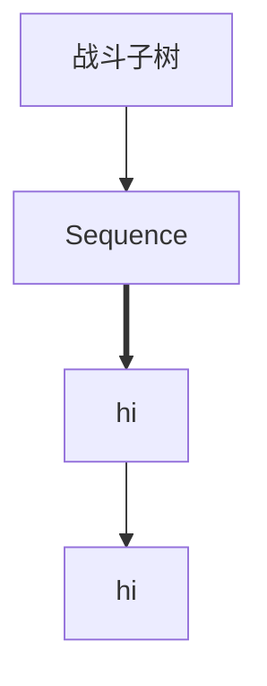

# ragnarok homuculus ai

developing

## test

去 ../ 目录

测试读取json
``lua AI_sakray/USER_AI/test/readjson.lua``

测试 Memory
``lua AI_sakray/USER_AI/test/memory.lua``

测试 Try
``lua AI_sakray/USER_AI/test/try.lua``

测试 AI loop
``lua AI_sakray/USER_AI/test/loop.lua``

```lua AI_sakray/USER_AI/test/test_behavior_tree.lua```

### 基本逻辑

- 战斗子树

