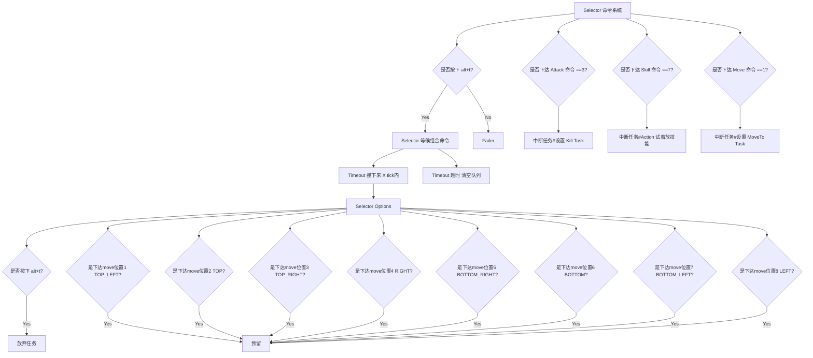
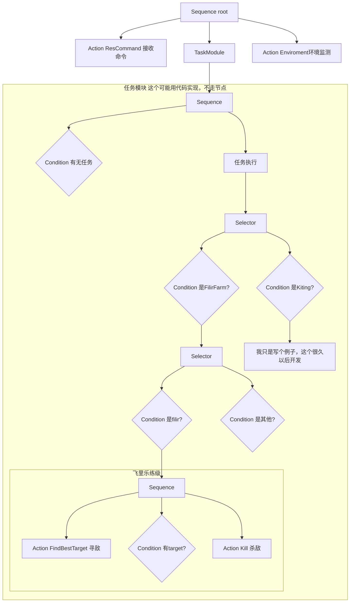

# ragnarok homuculus ai

最好给重命名一下哦
```git clone https://github.com/ranmeizi/ro-homu-ai.git AI_sakray```

## test

去 ../ 目录

测试读取json
``lua AI_sakray/USER_AI/test/readjson.lua``

测试 Memory
``lua AI_sakray/USER_AI/test/memory.lua``

测试 Try
``lua AI_sakray/USER_AI/test/try.lua``

测试 AI loop
``lua AI_sakray/USER_AI/test/loop.lua``

```lua AI_sakray/USER_AI/test/test_behavior_tree.lua```

### 行为树设计

#### Task 跨Tick的任务

全局只有唯一一个跨Tick的任务，因为生命体也不能同时干2件事，那该乱了。
通过 blackboard 记录这个任务的信息，第二次执行通过 Condition 检查是否有当前任务信息，如果返回不是running，才会清除这个任务，走到下个节点，也就是说 任务模块是优先级相当高的一个节点。

#### Core下实现了基础节点以及装饰节点

装饰节点没测过，用的时候再改吧

### 命令设计

基本只有 alt+t 和 alt+左键 可以发命令，那么就用这些组合设计一套命令系统。



### 基本逻辑

- Test 行为树
测试用的 瞎写


命令模块


任务模块


- Filir 行为树


Farm 逻辑

寻敌 -> kill target

kill target 逻辑

moveTo