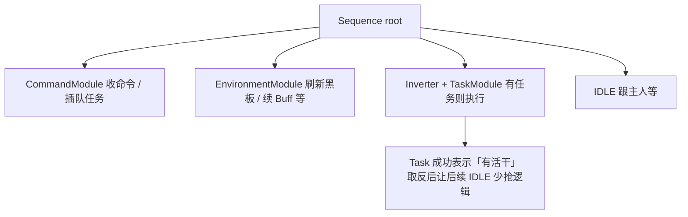
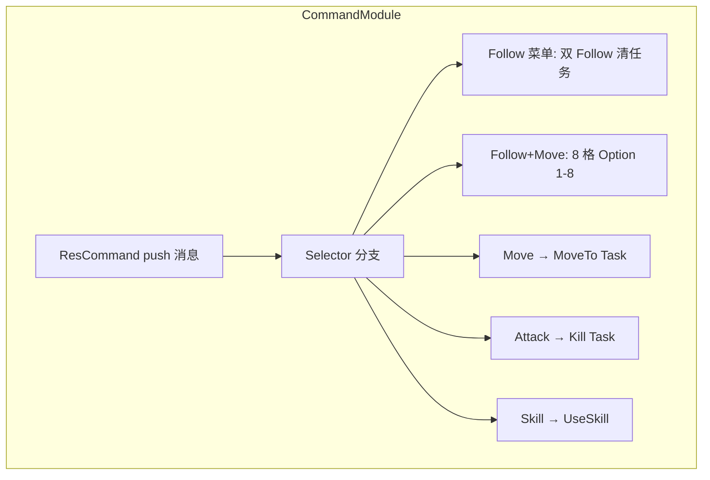

# Ragnarok 生命体 AI（Homunculus）

建议放到客户端 `AI_sakray` 目录下使用。仓库名可自定，例如：

```bash
git clone https://github.com/ranmeizi/ro-homu-ai.git AI_sakray
```

## 目录速览

| 路径 | 说明 |
|------|------|
| `USER_AI/AI.lua` | 入口：全局黑板、每 tick 跑 Filir 行为树 |
| `USER_AI/Const.lua` | 常量（技能 id、命令类型、节点状态等） |
| `USER_AI/Util.lua` | `TryJumpTask` 等工具函数 |
| `USER_AI/HOMU/Filir_behavior.lua` | 飞里乐主行为树根 |
| `USER_AI/BehaviorTree/common/subtrees/` | 命令 / 环境 / 任务分发子树 |
| `USER_AI/BehaviorTree/common/task/` | 各 Task 子树（Farm、Kill、Drain、Touch…） |
| `USER_AI/BehaviorTree/Core/` | 行为树基础节点与装饰器 |
| `USER_AI/types/dev.lua` | LuaLS 任务类型注解 |

## 本地测试

在仓库上级目录执行（按你本机 Lua 路径调整）：

```bash
lua AI_sakray/USER_AI/test/readjson.lua
lua AI_sakray/USER_AI/test/memory.lua
lua AI_sakray/USER_AI/test/try.lua
lua AI_sakray/USER_AI/test/loop.lua
lua AI_sakray/USER_AI/test/test_behavior_tree.lua
```

## 行为树设计

### 跨 Tick 的 Task

同一时刻**只执行一个**当前任务：`Blackboard.task`；其余排队在 `Blackboard.task_queue`（`Array`）。

需要「插队」时用 `TryJumpTask(task, options)`（`USER_AI/Util.lua`）：把当前任务 `unshift` 回队列，再挂上 `task`；可选 `removeUniqueTask` 去掉队列里同名任务，避免重复堆积。

具体子行为（移动、普攻、技能等）由各 `BehaviorTree/common/task/*.lua` 定义；其中 **Kill、MoveTo、UseSkill** 等用 `Task:new(...)` 包一层 **TaskNode**（`Core/DecoratorNodes/Task.lua`）：子节点返回非 `RUNNING` 时结束当前任务并从队列 `shift` 下一个。

### Core

`BehaviorTree/Core/`：`Sequence` / `Selector`、`Task`、`Timeout`、`Inverter`、`RunningOrNot`、`ActionNode`、`ConditionNode` 等。装饰器若边界行为不对，按实际 tick 再调。

## Filir 主树（当前默认）

根在 `HOMU/Filir_behavior.lua`：


```mermaid
flowchart TD
    R[Sequence root]
    R --> C[CommandModule 收命令 / 插队任务]
    R --> E[EnvironmentModule 刷新黑板 / 续 Buff 等]
    R --> T[Inverter + TaskModule 有任务则执行]
    R --> I[IDLE 跟主人等]

    T --> note[Task 成功表示「有活干」<br/>取反后让后续 IDLE 少抢逻辑]
```

执行顺序每帧：**命令 → 环境 → 任务 → 空闲**。

## 命令系统（CommandModule）

客户端消息由 `ResCommand` 写入 `Blackboard.cmds`（`Array`），`CommandModule` 消费。

### Alt+T 组合

- **第一条 + 第二条均为 FOLLOW_CMD**：清空 `cmds`、清空 `task` 与 `task_queue`（放弃所有任务）。
- **第一条 FOLLOW + 第二条 MOVE**：把 Move 的 **目标格** 与主人周围 **8 邻格**比对，命中则触发对应 **Option 1～8**（见下）；之后 `cmds` 会整理成单条 FOLLOW 并带 `Timeout`，超时清空命令。

### 主人周围 8 格 → Option 编号

相对主人 `(dx, dy)` → option（与代码 `getValidOptions` 一致）：

| option | 相对格 |
|--------|--------|
| 1 | 左上 (-1,1) |
| 2 | 上 (0,1) |
| 3 | 右上 (1,1) |
| 4 | 左 (-1,0) |
| 5 | 右 (1,0) |
| 6 | 左下 (-1,-1) |
| 7 | 下 (0,-1) |
| 8 | 右下 (1,-1) |

### 各 Option 行为（实现见 `CommandModule.lua`）

| Option | 行为 |
|--------|------|
| 1 | `TryJumpTask(Farm)`，续 Buff 无关 |
| 2 | 开关 `Blackboard.buff_conf`（飞里乐 Fleet/Speed 等，由 `EnvironmentModule` 续） |
| 3 | `TryJumpTask(Drain)` 大队 / 月光点名循环 |
| 4～7 | 预留（当前 `Todo` 仅清 `cmds`） |
| 8 | `TryJumpTask(Solve2048)` |

### 其它直连命令（不走 8 格菜单）

- **MOVE_CMD**：插队 `MoveTo`（`TryJumpTask`，`removeUniqueTask`）。
- **ATTACT_OBJET_CMD**：插队 `Kill`。
- **SKILL_OBJECT_CMD**：当场 `UseSkill`（不经过 Task 表）。

命令流程概览：


```mermaid
flowchart TD
    subgraph CM[CommandModule]
        RC[ResCommand push 消息]
        SEL[Selector 分支]
        RC --> SEL
        SEL --> F[Follow 菜单: 双 Follow 清任务]
        SEL --> O[Follow+Move: 8 格 Option 1-8]
        SEL --> M[Move → MoveTo Task]
        SEL --> A[Attack → Kill Task]
        SEL --> S[Skill → UseSkill]
    end
```

## 任务模块（TaskModule）

`TaskModule.lua` 根据 `Blackboard.task.name` 分发到已注册子树：

| name | 文件 | 简述 |
|------|------|------|
| `MoveTo` | `task/MoveTo.lua` | 走到坐标或目标 |
| `Kill` | `task/Kill.lua` | 接近并击杀（飞里乐分支 + 默认策略） |
| `Stop` | `task/Stop.lua` | 保持在屏内等 |
| `Farm` | `task/Farm.lua` | 寻敌 → `TryJumpTask(Kill)` 循环 |
| `Drain` | `task/Drain.lua` | 筛选特殊怪 → `TryJumpTask(Touch)` 循环 |
| `Touch` | `task/Touch.lua` | 对单怪一次月光 + `Drain.touchRegistry.mark` |
| `UseSkill` | `task/UseSkill.lua` | 单次技能 |

另有 `Testing_behavior.lua` 供实验树使用；线上循环在 `AI.lua` 里默认跑 `FilirBT`。

## Farm / Drain 模式（对照）

- **Farm**：`FindTarget` 选怪 → 有目标则插队 **Kill**；无目标可 `MoveToOwner`。结束全靠 **双 Alt+T** 清任务等。
- **Drain**：在月光射程内、怪有 `target`、未死亡、且未在 `Drain.touchRegistry` 里点过名的 → 插队 **Touch**；Touch 里 `UseSkill(1, HFLI_MOON, …)` 后登记 id，再交回 Drain 循环。

---

若文档与代码不一致，以 `USER_AI` 下 Lua 为准。
